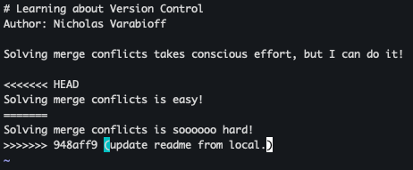
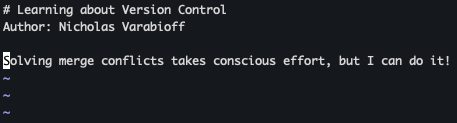
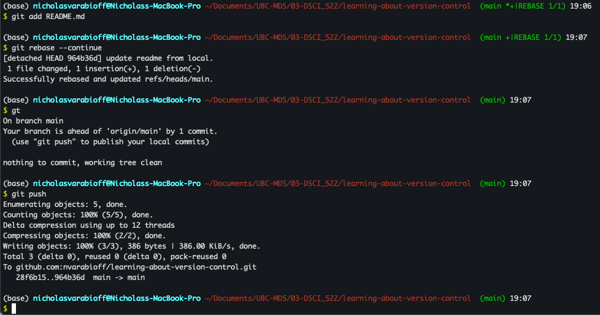

https://github.com/nvarabioff/learning-about-version-control/commits/main/

It is useful to work in a branch-pull-request workflow instead of working by directly committing each change to the main branch for a few reasons. One, the main branch might be deployed in a production environment, so untested changes should not be applied directly to an environment that is shown to users. Another reason is that branches make it easier to solve specific problems, as you can relate a branch directly to a problem. Another useful features of branches is the pull request feature, which makes it easy to share changes with teammates, adding a layer of protection against merging code that might cause errors.